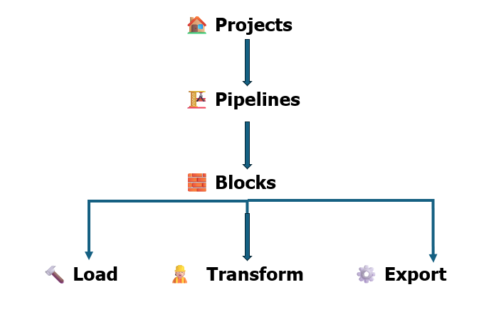

    
# Workflow Orchestration with Mage

## What is orchestration?

Orchestration refers to automated management, coordination and execution of mutiple work purposes and tasks.

In the context of data pipelines, orchestration refers to the coordination and management of various tasks and processes involved in the end-to-end flow of data. This includes activities such as data extraction, transformation, loading (ETL), data processing, and other related operations. The goal of orchestration in data pipelines is to ensure that these tasks are executed in a coordinated and efficient manner to achieve the desired outcomes.

Orchestration in data pipelines may involve:

    **Scheduling**: Determining when each task or process in the data pipeline should be executed. This ensures timely and efficient data processing.

    **Dependency Management**: Defining dependencies between different tasks to ensure that they are executed in the correct order. For example, data transformation should occur after data extraction.

    **Error Handling**: Managing and responding to errors that may occur during the execution of tasks, ensuring the reliability of the data pipeline.

    **Monitoring and Logging**: Tracking the progress of tasks, monitoring performance, and logging relevant information for troubleshooting and auditing purposes.

    **Scalability**: Orchestrating the allocation of resources to handle varying workloads, ensuring scalability as data volumes or processing requirements change.

## What is mage?

Mage is an open-source pipeline tool for orchestrating, transforming, and integrating data.

### Project

- A project forms the basis for all the work you can do in Mage— you can think of it like a GitHub repo. 

- It contains the code for all of your pipelines, blocks, and other assets.

- A Mage instance has one or more projects

### Pipeline

- A pipeline is a workflow that executes some data operation— maybe extracting, transforming, and loading data from an API. They’re also called DAGs on other platforms.

- In Mage, pipelines can contain Blocks (written in SQL, Python, or R) and charts.

- Each pipeline is represented by a YAML file in the “pipelines” folder of your project.

### Blocks

- A block is a file that can be executed independently or within a pipeline. 

- Together, blocks form Directed Acyclic Graphs (DAGs), which we call pipelines. 

- A block won’t start running in a pipeline until all its upstream dependencies are met.

- Blocks are reusable, atomic pieces of code that perform certain actions. 

- Changing one block will change it everywhere it’s used, but don’t worry, it’s easy to detach blocks to separate instances if necessary.

- Blocks can be used to perform a variety of actions, from simple data transformations to complex machine learning models. 

